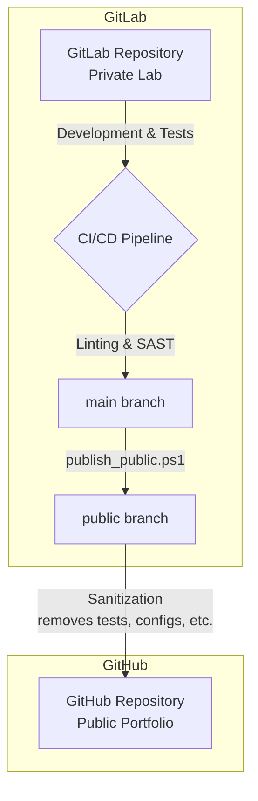

# PySysTools Architecture

## DevSecOps Release Flow

```mermaid
graph TD
    A[GitLab Repository <br/> Private Lab] -->|Development & Tests| B{CI/CD Pipeline}
    B -->|Linting & SAST| C[main branch]
    C -->|publish_public.ps1| D[public branch]
    D -->|Sanitization <br/> removes tests, configs, etc.| E[GitHub Repository <br/> Public Portfolio]
    
    subgraph GitLab
    A
    B
    C
    D
    end
    
    subgraph GitHub
    E
    end
```
